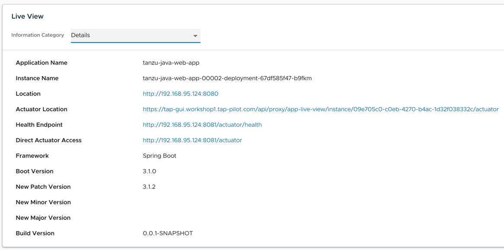
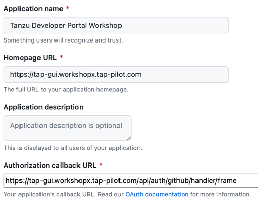
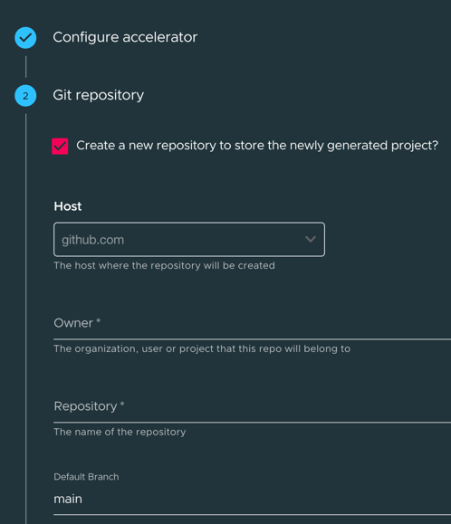

# Stage 5: Customize TAP Developer Portal

As a platform engineer, we can use our GitOps repo to incrementally add new features to our customers (the application developers!). In this section, we will roll out some new capabilities that our users can access through Tanzu Developer Portal (formerly known as TAP GUI).

## Catalog Entry

We will start by adding a [Catalog Entry](https://backstage.io/docs/features/software-catalog/configuration/) to Tanzu Developer Portal for the app we onboarded, `tanzu-java-web-app`. This will give developers access to additional capabilities through the portal.

Open your `tap-values.yaml` file, and add the following configuration under `tap_gui.app_config`:

```yaml
    tap_gui:
      app_config:
        catalog:
          locations:
            - type: url
              target: https://github.com/Tanzu-Solutions-Engineering/tanzu-java-web-app/blob/main/catalog/catalog-info.yaml
```

Commit your changes to the GitOps repo:
```bash
cd $WORKSHOP_ROOT/workshop-clusters
git add . && git commit -m "Added TDP catalog entry"
git push -u origin main
```

Once the changes have synced, you can go to your TDP home page, and you will see `tanzu-java-web-app` as a catalog option. Clicking on that allows you to select the Runtime Resources Tab, which will let you browse the Kubernetes resources associated with the app. Clicking on the most recent Pod entry on the Runtime Resources screen will give you access to Application Live View, which provides additional runtime information to developers:



## Add Github Repo Creation to Accelerators

Ooh, the developers liked that! Let's give them another goodie. We're going to add a capability to Accelerators so that developers have the option to create a Github repo when they generate a new project. Go to your `tap-values.yaml` file, and add the following stanza under `tap_gui.app_config`:

```yaml
    tap_gui:
      app_config:
        integrations:
          github:
            - host: github.com
```

Now, we need to create a Github Oauth app that Tanzu Developer Portal can interface with. Go to https://github.com/settings/applications/new to register a new Oauth Application. Be sure to change the DNS name in the URLs to point to your TAP instance:



Click 'Register application'. On the next screen, you will be shown your Client ID. Click on "Generate a new Client Secret" to get a client secret. Leave that screen up, with your Client ID and secret. We'll come back to it in a minute to get those values.

The ID and secret should be added to your `tap-values.yaml`, but these are sensitive values, so we'll need to encrypt them:

```bash
cd $WORKSHOP_ROOT/enc
vim tap-sensitive-values.yaml
```

Add the following configuration to this file:
```yaml
tap_install:
  sensitive_values:
    tap_gui:
      app_config:
        auth:
          providers:
            github:
              development:
                clientId: # Add your client ID
                clientSecret: # Add your client secret
```

Fill in the client ID/secret you generated, and then we'll encrypt the new values.

```bash
export SOPS_AGE_RECIPIENTS=$(age-keygen -y key.txt)
sops --encrypt tap-sensitive-values.yaml > tap-sensitive-values.sops.yaml
mv tap-sensitive-values.sops.yaml ../workshop-clusters/clusters/workshop/cluster-config/values
```

You know the drill, commit your changes!
Commit your changes to the GitOps repo:
```bash
cd $WORKSHOP_ROOT/workshop-clusters
git add . && git commit -m "Added Github repo support to accelerators"
git push -u origin main
```

Now, when you generate an accelerator from the web interface or from your IDE, you will have the option to create an associated Github repo:



Using your GitOps repo, you can continue to incrementally add the features and capabilities that are important to your customers.

## [Next Stage: Blow it away! Reinstall!>>](Stage-6-reinstall.md)